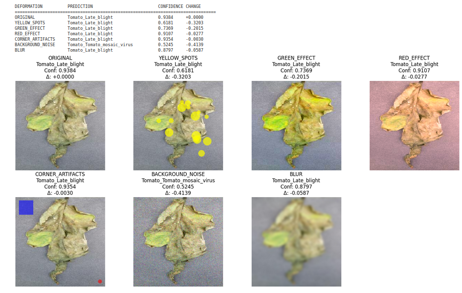

# manifold-explorer
Beyond Accuracy: A case study in building trustworthy AI by stress-testing, explaining, and optimizing a computer vision model for robust deployment on an edge device.
## Core Philosophy of the Project

The purpose of this project is not to blindly chase accuracy. Our main goal is to understand the gap between a model's theoretical **"known world"** and the chaotic **"real world"** and to bridge this gap.

We define this with a mathematical objective:
* `E`: The infinite space of all possible images in the real world.
* `D`: Our clean, "studio" dataset at hand.
* `D''`: The learned space (learned manifold) that our model understands and can "comfortably navigate."

Our task is to explore the boundaries of the model's comfort zone `D''`. We aim to expand this area toward regions of `E` that were not previously covered. This means understanding and narrowing the **error manifold** **ε = E \ D''** (the area where the model doesn't know and will make mistakes).

*In short, we aim to make the model more reliable by hunting down its weaknesses.*

** Methodological Note:** The execution of this project by a single researcher carries a **natural bias risk** in Red Teaming and Chaos Testing designs. The discovered weaknesses should be interpreted with this constraint in mind.

## Initial Research: Which Model Knows How to Say "I Don't Know"? (`01_baseline_finetune.ipynb`)

Starting with this philosophy, our first task was to find a model that behaves "honestly" in the face of uncertainty. We compared two popular architectures based on this principle.

### Experiment 1: ResNet - A Dangerous Overconfidence

Our initial tests with ResNet were a vivid proof of why high accuracy rates can be misleading.

* **Setup:** We fine-tuned the model with over 150,000 augmented images.
* **Misleading Result:** We achieved an absurdly high accuracy of **97%** on the "easy" validation set.
* **Stress Test Findings:** When the model stepped outside its comfort zone, it refused to say "I don't know."
   * It produced **absurd predictions** even with the slightest image corruptions.
   * More worryingly, it acted with **dangerous overconfidence** (99%+ confidence) while making these errors. There was almost no decrease in confidence scores.
* **Grad-CAM**: The heatmap below shows ResNet's tendency to focus on broader, less specific regions.

* **Overconfidence Analysis**: The plot clearly demonstrates ResNet's dangerous overconfidence. The confidence distribution for stress-test data (red) remains dangerously high, overlapping almost completely with the distribution for normal data (blue).

**Summary:** ResNet was an unreliable candidate, prone to making errors silently and with self-assurance.

### Experiment 2: EfficientNet - An Honest Uncertainty

EfficientNet, however, exhibited a completely different character.

* **Setup:** We applied the same training process to EfficientNet.
* **Stress Test Findings:** The model gave an honest response when faced with unfamiliar data.
   * As if saying "I haven't seen these areas, I don't know what to do," it showed **significant and consistent decreases** in confidence scores.
   * This behavior indicated that the model better understood the limits of its own knowledge.
* **Grad-CAM**: In contrast, EfficientNet focuses sharply on the relevant areas of the leaf, as shown in the heatmap.

* **Overconfidence Analysis**: This plot highlights EfficientNet's "honest uncertainty." When faced with stress-test data (red), the model's confidence distribution shifts significantly to the left, indicating it "knows what it doesn't know."

**Summary:** EfficientNet offered a more solid foundation as a model that "knows what it doesn't know" and was selected for the continuation of the project.

---
## License

This project is licensed under the [Creative Commons Attribution-NonCommercial-ShareAlike 4.0 International License](https://creativecommons.org/licenses/by-nc-sa/4.0/).

